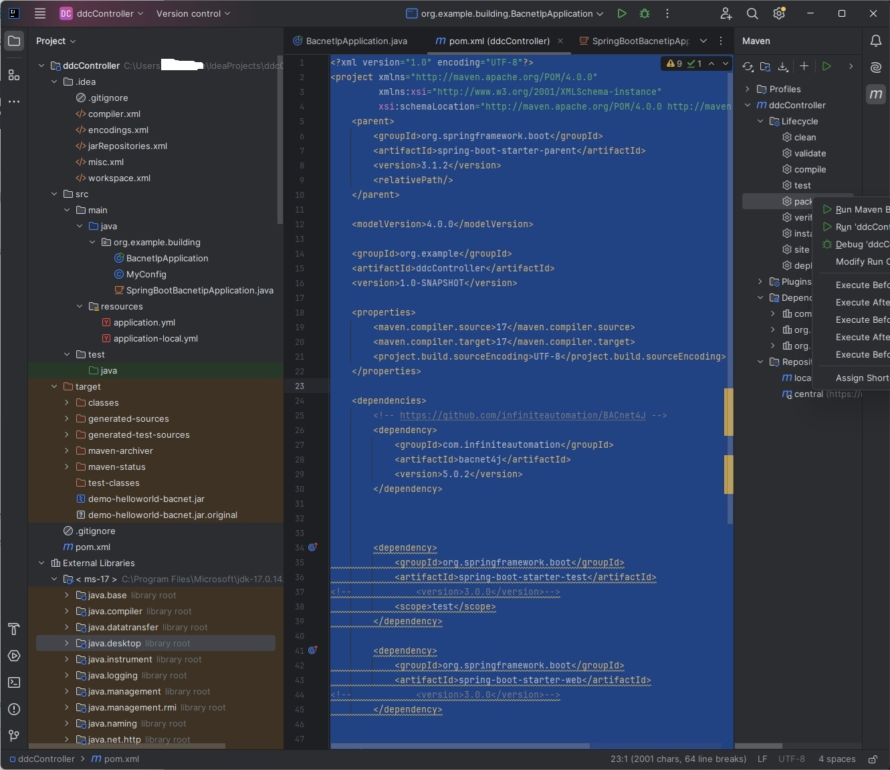
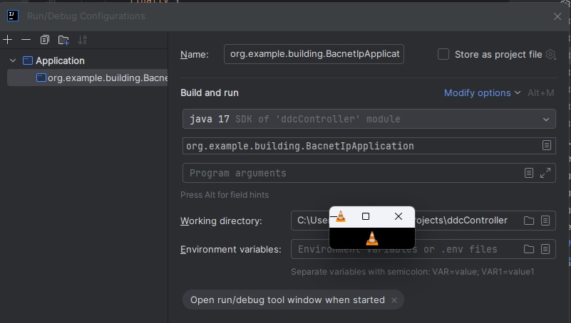

<!-- vscode-markdown-toc -->
* 1. [网络拓扑 ##](#)
* 2. [虚拟机的参与 ##](#-1)
* 3. [虚拟机网卡设置 ##](#-1)
* 4. [云虚机的情况 ##](#-1)
* 5. [云供应商的负载均衡 ##](#-1)
* 6. [mosquitto安装配置 ##](#mosquitto)
	* 6.1. [版本 ###](#-1)
	* 6.2. [分摊服务器 ###](#-1)
	* 6.3. [关口服务器 ###](#-1)
* 7. [普通mosquitto.conf ##](#mosquitto.conf)
* 8. [ MQTTs broker单机验证 ##](#MQTTsbroker)
* 9. [nginx安装 ##](#nginx)
	* 9.1. [源码编译安装带stream选项的nginx ###](#streamnginx)
* 10. [nginx配置 ##](#nginx-1)
* 11. [Java (后台)项目务虚 ##](#Java)
* 12. [一个实际运行的ddc控制器程序 ##](#ddc)
* 13. [与springboot 结合 ##](#springboot)
* 14. [利用intelliJ IDE以及maven3.3+ 编译代码和打包、发布artifacts ##](#intelliJIDEmaven3.3artifacts)
* 15. [利用日志 ##](#-1)
* 16. [经典调试工具以及生产力环境的熟悉和使用 ##](#-1)
* 17. [ 通关后 ##](#-1)
* 18. [追踪nginx 配置 ##](#nginx-1)
	* 18.1. [云服务与本地部署Kafka区别 ###](#Kafka)
* 19. [jdk8平滑升级到17 ##](#jdk817)
* 20. [修改intellij IDE的maven 配置文件和仓库位置 ##](#intellijIDEmaven)
* 21. [修改上述指向的maven .m2\settings.xml ##](#maven.m2settings.xml)
* 22. [添加mirror站点 ##](#mirror)
* 23. [IntelliJ 内嵌mvn 位置 ##](#IntelliJmvn)
* 24. [初步执行结果 ##](#-1)
* 25. [初始化 一个最小化的springboot 项目 ##](#springboot-1)
	* 25.1. [实验的环境准备-下载pom和jar到本地 ###](#-pomjar)
	* 25.2. [实验的环境准备-下载完了不能直接用 ###](#-)
	* 25.3. [实验的环境准备-导入本地mvn ###](#-mvn)
	* 25.4. [实验的环境准备-JAVA/JVM版本 ###](#-JAVAJVM)
	* 25.5. [实验的环境准备-springboot版本以及plugin ###](#-springbootplugin)
	* 25.6. [实验的环境准备-Client代码 ###](#-Client)
	* 25.7. [实验的环境准备-pom以及坐标 ###](#-pom)
	* 25.8. [实验环境准备-系统调试 ###](#--1)
	* 25.9. [实验环境准备-wiireshark用武之地 ###](#-wiireshark)
	* 25.10. [实验环境准备-枚举设备点位 ###](#--1)
	* 25.11. [实验环境准备-部署和运行 ###](#--1)
	* 25.12. [实验环境准备-服务在线 ###](#--1)
* 26. [查错 ##](#-1)
* 27. [实操 ##](#-1)
* 28. [绝非原创声明 ##](#-1)

<!-- vscode-markdown-toc-config
	numbering=true
	autoSave=true
	/vscode-markdown-toc-config -->
<!-- /vscode-markdown-toc -->[TOC]


我以想到哪里写到哪里的办法记录一次本地部署过程，FYI.

# 下文提到的工程软件 #
putty
winscp
vmware ws + GNU/UBUNTU22.04
nginx
mosquitto broker
bacnet4j package
bacnet-stack CLanguage OSS stack 

# 利用局域网和虚机 #
实验的环境准备，利用虚机和虚拟网卡实现集群
vmware搭载的镜像选择bridge网桥模式
每个镜像的网桥模式只能位于同一个网卡网段
可以划分虚拟子网，做隔离和转发

##  1. <a name=''></a>网络拓扑 ##
暴露外部的server
10.0.1.2/24
后台server集群
10.0.1.2
10.0.1.3/24
自建应用lb 的隐含前提是你能控制网络和机器IP\拓扑。


##  2. <a name='-1'></a>虚拟机的参与 ##
用到了vmware，其它等效软件例如virtualbox 原理相同操作不同

##  3. <a name='-1'></a>虚拟机网卡设置 ##
Virtual machine网络选择bridged
安装镜像时dhcp 程序给你分配的不是你中意的一个网络怎么办？这里可能你要稍稍注意一下，像我的物理机有2张网卡，其中一张接入北向Internet，另外一张接入南向factory 网络。默认的网段可能不是你要的，需要进 “虚拟网络编辑器” 选择


##  4. <a name='-1'></a>云虚机的情况 ##
需要console 权限以修改对应的虚拟网络和虚拟网卡


##  5. <a name='-1'></a>云供应商的负载均衡 ##
各大云都有原生的负载均衡提供，可以作为技术对标参考。

# mosquitto本地部署验证 #
从mqtts broker 入手

##  6. <a name='mosquitto'></a>mosquitto安装配置 ##

###  6.1. <a name='-1'></a>版本 ###

```
mosquitto version 2.0.18
mosquitto is an MQTT v5.0/v3.1.1/v3.1 broker.
```

###  6.2. <a name='-1'></a>分摊服务器 ###

```
pid_file /run/mosquitto/mosquitto-ssl.pid
persistence true
persistence_location /var/lib/mosquitto-ssl/
log_dest file /var/log/mosquitto-ssl/mosquitto-ssl.log
include_dir /etc/mosquitto/conf.d
listener 9883
cafile /data/software/config/cert/ssl/ca/ca.crt
certfile /data/software/config/cert/ssl/server/server.crt
keyfile /data/software/config/cert/ssl/server/server.key
allow_anonymous false
require_certificate true
password_file /etc/mosquitto/pwfile-ssl
acl_file /etc/mosquitto/aclfile-ssl
```
通过netstat 指令确认代理服务正常监听端口。

###  6.3. <a name='-1'></a>关口服务器 ###

```
pid_file /run/mosquitto/mosquitto-9883.pid
persistence true
persistence_location /var/lib/mosquitto/
log_dest file /var/log/mosquitto/mosquitto-9883.log
log_type all
connection_messages true
include_dir /etc/mosquitto/conf.d
max_inflight_messages 0
port 9883
allow_anonymous false
password_file /etc/mosquitto/pwfile

```
通过netstat 指令确认代理服务正常监听端口。


##  7. <a name='mosquitto.conf'></a>普通mosquitto.conf ##

```

pid_file /run/mosquitto/mosquitto.pid
persistence true
persistence_location /var/lib/mosquitto/
log_dest file /var/log/mosquitto/mosquitto.log
include_dir /etc/mosquitto/conf.d
listener 1884
cafile /etc/mosquitto/certs/ca.crt
certfile /etc/mosquitto/certs/server.crt
keyfile /etc/mosquitto/certs/server.key
allow_anonymous false
password_file /etc/mosquitto/pwfile
acl_file /etc/mosquitto/aclfile

```

作为daemon service 工作。
实行的是双向证书认证 - 由自签的根证书签发server证书和client证书以及私钥，配合app发放可以做到一机一密。

##  8. <a name='MQTTsbroker'></a> MQTTs broker单机验证 ##
以上mosquitto.conf配置 完成后验证确认单机正常工作。通过client sub和pub 以及比对 mosquitto.log确认。
高负荷、scaleing、水平扩展、并行上送等场景会要求集群部署。

```
sudo apt-get install mosquitto mosquitto-clients    
```


# 选择nginx 工具实现mosquitto 负载均衡 #
部署到用户网络时考虑用nginx 集群，利用2 台vmware虚拟机实现mqtts消息集群以及相应的Java 后台微服务的LB。
我们的部署方案是前端mqtts 收数而后台用Java 微服务处理。
它们分别使用
-   mqtts 由mosquitto 开源软件承载
-   负载均衡由 nginx 工具承载


##  9. <a name='nginx'></a>nginx安装 ##

apt install nginx 默认不安装stream 特性。

解决方案有2，一种apt 安装扩展包
```

sudo apt-get update
sudo apt-get install build-essential libpcre3 libpcre3-dev zlib1g zlib1g-dev libssl-dev
sudo apt-get -y install nginx nginx-extras

```
另一种：源码直接编译安装nginx；特定版本nginx 依赖openssl 以及特定OS的交叉版本 解决版本冲突 选择合适版本编译安装 nginx1.24.0 类似的版本

```

./configure --with-stream
...
make
sudo make install

```
安装到 /usr/local/nginx 目录
检查stream模块是否已经包含：
/usr/local/nginx/sbin/nginx -V
```

rel@svr2:/etc$ nginx -V
nginx version: nginx/1.18.0 (Ubuntu)
built with OpenSSL 3.0.2 15 Mar 2022
TLS SNI support enabled
configure arguments: --with-cc-opt='-g -O2 -ffile-prefix-map=/build/nginx-niToSo/nginx-1.18.0=. -flto=auto -ffat-lto-objects -flto=auto -ffat-lto-objects -fstack-protector-strong -Wformat -Werror=format-security -fPIC -Wdate-time -D_FORTIFY_SOURCE=2' --with-ld-opt='-Wl,-Bsymbolic-functions -flto=auto -ffat-lto-objects -flto=auto -Wl,-z,relro -Wl,-z,now -fPIC' --prefix=/usr/share/nginx --conf-path=/etc/nginx/nginx.conf --http-log-path=/var/log/nginx/access.log --error-log-path=/var/log/nginx/error.log --lock-path=/var/lock/nginx.lock --pid-path=/run/nginx.pid --modules-path=/usr/lib/nginx/modules --http-client-body-temp-path=/var/lib/nginx/body --http-fastcgi-temp-path=/var/lib/nginx/fastcgi --http-proxy-temp-path=/var/lib/nginx/proxy --http-scgi-temp-path=/var/lib/nginx/scgi --http-uwsgi-temp-path=/var/lib/nginx/uwsgi --with-compat --with-debug --with-pcre-jit --with-http_ssl_module --with-http_stub_status_module --with-http_realip_module --with-http_auth_request_module --with-http_v2_module --with-http_dav_module --with-http_slice_module --with-threads --add-dynamic-module=/build/nginx-niToSo/nginx-1.18.0/debian/modules/http-geoip2 --with-http_addition_module --with-http_flv_module --with-http_geoip_module=dynamic --with-http_gunzip_module --with-http_gzip_static_module --with-http_image_filter_module=dynamic --with-http_mp4_module --with-http_perl_module=dynamic --with-http_random_index_module --with-http_secure_link_module --with-http_sub_module --with-http_xslt_module=dynamic --with-mail=dynamic --with-mail_ssl_module --with-stream=dynamic --with-stream_geoip_module=dynamic --with-stream_ssl_module --with-stream_ssl_preread_module --add-dynamic-module=/build/nginx-niToSo/nginx-1.18.0/debian/modules/http-headers-more-filter --add-dynamic-module=/build/nginx-niToSo/nginx-1.18.0/debian/modules/http-auth-pam --add-dynamic-module=/build/nginx-niToSo/nginx-1.18.0/debian/modules/http-cache-purge --add-dynamic-module=/build/nginx-niToSo/nginx-1.18.0/debian/modules/http-dav-ext --add-dynamic-module=/build/nginx-niToSo/nginx-1.18.0/debian/modules/http-ndk --add-dynamic-module=/build/nginx-niToSo/nginx-1.18.0/debian/modules/http-echo --add-dynamic-module=/build/nginx-niToSo/nginx-1.18.0/debian/modules/http-fancyindex --add-dynamic-module=/build/nginx-niToSo/nginx-1.18.0/debian/modules/nchan --add-dynamic-module=/build/nginx-niToSo/nginx-1.18.0/debian/modules/rtmp --add-dynamic-module=/build/nginx-niToSo/nginx-1.18.0/debian/modules/http-uploadprogress --add-dynamic-module=/build/nginx-niToSo/nginx-1.18.0/debian/modules/http-upstream-fair --add-dynamic-module=/build/nginx-niToSo/nginx-1.18.0/debian/modules/http-subs-filter

```


###  9.1. <a name='streamnginx'></a>源码编译安装带stream选项的nginx ###
略

##  10. <a name='nginx-1'></a>nginx配置 ##

IoT消息遥测的server1.nginx.conf配置如下

```
###nginx.conf

events {
    worker_connections 1024;
}
http {
}
#在http外添加如下配置
stream {
    upstream rabbitmqtt {
        least_conn;
        server 10.0.1.2:9883;
        server 10.0.1.3:9883;
    }

    server {
        listen       9884 so_keepalive=on;
        proxy_connect_timeout 60s;
        proxy_timeout 60s;
        proxy_pass rabbitmqtt;
        tcp_nodelay on;
    }
}

```

实体conf 可以放在conf.d目录。
least_conn 为均衡策略可以用搜索引擎解析详细的参数含义，以上sample 描述的是再host上开启9884端口接入mqtts服务并利用后台10.0.1.2/10.0.1.3 两台服务器的9883承载消息服务

# 利用 cloud实现lb #
如果你有云计算资源而且购买了lb功能包可以在console里开启

# on-premise 自建 #
这部分的具体实施就是本地部署过程

# 开发 #
时至今日Dev 仿佛变成了人类默认掌握的技能就像19世纪帝国臣民具备纺线的技能一样。
工具选择Java 套餐，包括开发环境、包管理、编译和调试、打包
如果你想正规一点加一个git 做做版本管理
如果你想本地协作那就研究研究本地maven仓库或者私有仓库
在此同时看看github 上的符合你要求的开源库的copyright 描述
再看看它的功能是否满足你的业务拓展需求？
对于通信协议而言，这个package如果能做到handshake, connect, read, write, alarm event 就够了
再研究研究数据类型和扩展类型
最后如果真的要当真用，实测并计算吞吐量性能 IO性能比较难以理解他跟网络环境关系往往比较大OS的内存CPU 网卡带宽也有影响最好有一台目标机同类型实物用来performance/conformance Testing 
除了提纲提到的那些玩意你还是要多写多调把目标定的稍高一点代码稍整洁一点，就可以了吧。


##  11. <a name='Java'></a>Java (后台)项目务虚 ##
一个BACNET IP 客户端。用来发现远程 DDC。
请记住，这仅仅是一次示例，工业化软件有诸多维度，本文考量的是可得性availability 就是趟过一遍你基本清楚你会了什么（无法了解还有什么你不会的）


##  12. <a name='ddc'></a>一个实际运行的ddc控制器程序 ##
这个程序你可以用来二次开发，让他去写和控制设置DDC 例如空调暖通的设定值。
软件自身奇怪的地方，既什么也干不了又什么都能做。
你无法定义软件，因为就像twins 
像调试硬件和软件，你很难说清楚到底是哪一个问题？像当你你说一个人的时候不仅包括血肉也包括骨架还包括思维习性脾气情绪面相- 这些东西生来就是一起的。

##  13. <a name='springboot'></a>与springboot 结合 ##
微服务现在很盛行，虽然我觉得它没什么价值 但既然在开发圈里我们就利用它来蹭一波热度
它也就是给每个至小的代码套上了一个webservice 辔头。
模块间通信格式就可能固化了硬化成了RESTful API接口。
就能满足所谓横向扩展的要求
总而言之是扒开裤头才能看到屁股还是扒开屁股才能看到裤头的区别
这里我也会把这个发现程序放到springboot 3 里去run。见识见识API 的无用之用


##  14. <a name='intelliJIDEmaven3.3artifacts'></a>利用intelliJ IDE以及maven3.3+ 编译代码和打包、发布artifacts ##
既然说到软件就不得不说发行/发布。就是英文里的release
再者就是打包 有了这个才方便部署。
目标机器只要在support 范围之内才能安装。考虑并发性和性能瓶颈 
打包jar 时有一些必须注意的，例如，开发时引用的jar 包都是不含依赖的所以个头比较小，照理说这种打包方式号称便于切换依赖的version。但实际上注定演变成依赖树的版本hell。为什么呢？每个库的依赖版本时特定的范围，换了依赖即意味它的父亲和爷爷以及祖先都要换版本。哪来的简单行事。
生产的话都用full jar即将所有依赖打包进来。运输到现场直接开箱即用即插即用。


##  15. <a name='-1'></a>利用日志 ##
软件成功安装到服务器后唯一的调试手段就是日志。包括mosquitto ， pg等。这里面也能看出来性能瓶颈。例如SQL 查询时间，吞吐量。只要又日志，根据时间戳和线程号计算性能就出来了。

##  16. <a name='-1'></a>经典调试工具以及生产力环境的熟悉和使用 ##
GNU/LINUX是不二法门。去用吧

##  17. <a name='-1'></a> 通关后 ##
有很多感想？ 那就写出来吧。

# Java (后台)项目 #

mqtts 代理类服务，指定程序运行IP运行。
Java后台程序，接收mqtts传入的输入并处理-最好是能做到并发或者并行，除了crud以外。

负载均衡服务器分摊给若干台局域网计算机，一个请求不知道也不确定最终将由哪台局域网计算机提供服务。以mqtt服务为例，假设
	关口服务器=10.0.1.2
位于后台外网不可见
	分摊服务器=10.0.1.3


```

root@ptc-prod-01:~# netstat -tnlp|grep mosquitto
tcp        0      0 0.0.0.0:1883            0.0.0.0:*               LISTEN      671/mosquitto
tcp        0      0 0.0.0.0:1884            0.0.0.0:*               LISTEN      2555275/mosquitto
tcp        0      0 0.0.0.0:9883            0.0.0.0:*               LISTEN      3192362/mosquitto

```

Java 程序负责监听9883 这个服务
后台程序指定了IP地址。 
ssh连到分摊服务器查询

```
tcp6       0      0 :::9883                 :::*                    LISTEN      1773286/mosquitto
```

还不是上述这条，我们要查询ipv4 空间

```

tcp        0      0 0.0.0.0:9883            0.0.0.0:*               LISTEN      1773286/mosquitto

```

负载均衡部署听上去很前卫但，对于查错非常不便，因为一个用户请求不知最终分摊到哪台电脑。
往往只能在数据json 里放一个ID 通过这个索引 去日志发现一些端倪。
例如通过设备编号追踪处理流。每一个请求必有不同于其它请求的标签


##  18. <a name='nginx-1'></a>追踪nginx 配置 ##

拿到一台机器想查找当前生效的服务和配置时可以这么做

    -   systemctl status nginx


```

root@svr:/usr/local/nginx/conf# systemctl status nginx
● nginx.service - The NGINX HTTP and reverse proxy server
     Loaded: loaded (/etc/systemd/system/nginx.service; enabled; vendor preset: enabled)
     Active: active (running) since Wed 2025-02-26 08:43:37 UTC; 5 days ago
    Process: 2883 ExecStartPre=/usr/local/nginx/nginx -t (code=exited, status=0/SUCCESS)
    Process: 2884 ExecStart=/usr/local/nginx/nginx (code=exited, status=0/SUCCESS)
   Main PID: 2885 (nginx)
      Tasks: 2 (limit: 4519)
     Memory: 1.8M
        CPU: 18.792s
     CGroup: /system.slice/nginx.service
             ├─2885 "nginx: master process /usr/local/nginx/nginx"
             └─2886 "nginx: worker process" ""

Feb 26 08:43:37 svr systemd[1]: Starting The NGINX HTTP and reverse proxy server...
Feb 26 08:43:37 svr nginx[2883]: nginx: the configuration file /usr/local/nginx/conf/nginx.conf syntax is ok
Feb 26 08:43:37 svr nginx[2883]: nginx: configuration file /usr/local/nginx/conf/nginx.conf test is successful
Feb 26 08:43:37 svr systemd[1]: Started The NGINX HTTP and reverse proxy server.

```
    -   cat /usr/local/nginx/conf/nginx.conf 

此为当前生效的nginx 服务属性。


对后台Java 微服务可以追踪它们的命令行配置，那么对于nginx如果你熟悉了GNU/LINUX 指令那原理一模一样，首先查出关口服务器的配置

```
 ps -aux|grep nginx

```

子层级配置可能位于

    -   include /etc/nginx/modules-enabled/*.conf;
以及
    -   include /etc/nginx/conf.d/*.conf;

给出的配置往往这样

```

upstream latium_energy_business {
    server 10.0.1.2:15204;
    server 10.0.1.3:15204;
    keepalive 64;
    keepalive_requests 1000;
}

upstream latium_hvac_business {
    server 10.0.1.2:15304;
    server 10.0.1.3:15304;
    keepalive 64;
    keepalive_requests 1000;
}

upstream latium_scada_business {
    server 10.0.1.2:15404;
    server 10.0.1.3:15404;
    keepalive 64;
    keepalive_requests 1000;
}
```

工程人员自己手工搭建Load balance 就意味着你也同时担负了运维调试责任，这块要达到和采购云服务商集成的LB服务同等效果还是破费精力的

除了负载均衡以外，其它的例如Kafka，Redis, PostgreSQL, InfluxDB, 都可以购买服务。但是Mosquitto 代理往往还是自己搞的高危版本


###  18.1. <a name='Kafka'></a>云服务与本地部署Kafka区别 ###
云部署的Kafka 在程序创建新topic 后订阅程序并不能收到topic 隶属的消息。通过ali云控制面板能看到消息累积-group 下的消息并不能为订阅程序消费。而本地部署的Kafka 不存在这个缺陷。云服务运行时新增topic 需要重启订阅程序再一次订阅而在本地部署的不需要。


##  19. <a name='jdk817'></a>jdk8平滑升级到17 ##
通过预先设定的目录结构兼容CICD 产物的自动push

升级前安装2套jvm 环境
```

root      464410  0.3  1.2 6224388 824288 ?      Sl    2023 2476:51 /usr/local/jdk1.8.0_351/bin/java -jar -Duser.timezone=GMT+8 -XX:+PrintGCDetails -Xms512M -Xmx512M mosquitto-to-bacnet-1.0-temp.jar --spring.profiles.active=temp --spring.application.name=mosquitto-to-bacnet-temp --basis.host=10.0.1.2

```

```

root     3577390  0.0  0.0   2612   604 ?        Ss   Feb12   0:00 /bin/sh -c /usr/lib/jvm/java-17-openjdk-amd64/bin/java -jar -Duser.timezone=GMT+8 -XX:+PrintGCDetails -Xms512M -Xmx1024M /data/software/bin/iot-mosquitto-to-bacnet/current/*.jar --spring.profiles.active=release --basis.host=10.0.1.2 >/dev/null 2>&1

```

以上运行指令架构下，CICD产线每次编译测试通过后push 到software/bin/modules name 目录下且新建一个包含时间戳tag 的目录。实体jar 包放在该目录下。并在上层目录software/bin/modules name下ln 指令创建一个符号链接文件。这个指令创建一个符号链接文件。这个符号链接指向新建的目录。指令去current符号链接到新建的目录。java -jar指令去current 目录下寻找jar的。

# on-premise 自建环境的本地化搭建 #
代码只有在写不出来的程序员那里有价值，同理，bug仅在测不出来的地方有意义，同样系统崩溃在well done的压测上才惊艳-大部分程序员出身的人你让他去做压测根本没法测出瓶颈。集群部署这样的技术可以调整，但是关键还在于solution arch架构设计。这里指的是 搭建本地集群来部署


云运维就是你自己创造网络和路由。如果你有虚拟子网划分操作经验对于理解这些会加分，当然终极方法就是自己用几台物理机和虚机实际操作一遍。
本地部署的一个惊喜就是你用搜索引擎搜到的知识所有的指令都有可能报错。

```

C:\Program Files\JetBrains\IntelliJ IDEA Community Edition 2024.3.3\plugins\maven\lib\maven3\bin
mvn install:install-file  -DgroupId="com.infiniteautomation" -DartifactId="bacnet4j" -Dversion="5.0.2" -Dpackaging="jar" -Dfile="C:\Users\y0034kdd\Documents\repo_mvn\bacnet4j-5.0.2.jar"

mvn install:install-file  -DgroupId="ai.serotonin.oss" -DartifactId="sero-scheduler" -Dversion="1.1.0" -Dpackaging="jar" -Dfile="C:\Users\y0034kdd\Documents\repo_mvn\bacnet4j-5.0.2.jar"
```
我记得曾经这一关花了我半天时间


##  20. <a name='intellijIDEmaven'></a>修改intellij IDE的maven 配置文件和仓库位置 ##
默认是不激活这里的选项，安装完成后我们除了要使用ide 内置的mvn 而且需要使能这里的默认选项（配置文件和仓库路径）

##  21. <a name='maven.m2settings.xml'></a>修改上述指向的maven .m2\settings.xml ##
引用本地仓库位置。
例如 <localRepository>D:\Program Files\maven_repository</localRepository>。我偷懒使用了上一步的路径。本地仓库和默认仓库默认放在一起。

##  22. <a name='mirror'></a>添加mirror站点 ##
例如 所有坐标 <mirrorOf>*</mirrorOf> 导向 国内站点。

##  23. <a name='IntelliJmvn'></a>IntelliJ 内嵌mvn 位置 ##
"C:\Program Files\JetBrains\IntelliJ IDEA Community Edition 2024.3.3\plugins\maven\lib\maven3\bin\mvn" 

##  24. <a name='-1'></a>初步执行结果 ##
经过附录描述的开发步骤，你的后台程序有了：

``` 
RemoteDevice(instanceNumber=131314, address=Address [networkNumber=0, macAddress=[a,0,0,40,d9,90]])
[device 131314, analog-input 0, analog-input 1, analog-input 2, analog-value 0, analog-value 1, analog-value 2, analog-value 3, characterstring-value 1, binary-value 0, binary-value 1, multi-state-value 0, multi-state-value 1]
13

``` 
而且可喜的是它也能subscribe 订阅到现场发送来的mqtts 指令
得到这个结果，可以了少年，你可以去破解下一个谜案了 


# 附录 #
开发和部署使用到的关键工具dee实操。


##  25. <a name='springboot-1'></a>初始化 一个最小化的springboot 项目 ##
项目目标为启动和运行一个BacNET IP发现远程服务器并枚举测点的功能。利用who is以及i am 协议原语。作为一名老手他可能在动手之前要弄到一些资源以及合适的release，包括但不限于JVM, springboot, maven, 驱动库package 此处等于 bacnet4j 5.0.2。

springboot 是包围在外面的一层web 服务器类似Node.js 里的Express 脚手架。最小化系统思路下我们最开始调试通过bacnet4j client 并完成功能调试，再绑定web service。

在调试阶段，我们没必要一开始就学习webservice 写法 尽可以用main() 函数主入口调通 最小化系统开始 具体做法就是设定web 访问路径和函数方法例如https://ddc.all/controllers/all, 函数用[GET] h好了。

为什么一定要和webservice 牵扯在一起？ 也许是为了展示nginx 的用法。

-   intelliJ 提供代码编辑整齐方法 
-   maven 提供依赖包的坐标和导入、引用、编译
-   jar 包实际上是压缩文件你尽可以解压看meta 等嵌入信息

借助intelliJ 和maven 来编译代码原理及应用


###  25.1. <a name='-pomjar'></a>实验的环境准备-下载pom和jar到本地 ###
利用搜索引擎 bing必应 搜索 “maven + bacnet4j” 第一个结果点击进去选择它较新的版本5.0.2 以避免不必要的依赖库失配灾难。之所以选这个包因为它不仅是一款合格的连接器且能解释一些极端情况，例如库名和坐标引用的解耦-解压可以看到一个奇怪的路径，而这个路径是和后面要导入的动作有关。如果你想学习一个jar 包，你想控制整个学习过程，那么下载他吧，致敬开源世界。

###  25.2. <a name='-'></a>实验的环境准备-下载完了不能直接用 ###

下载下来的jar 包不能直接利用。也就是说以下

```
<!-- https://mvnrepository.com/artifact/com.infiniteautomation/bacnet4j -->
<dependency>
    <groupId>com.infiniteautomation</groupId>
    <artifactId>bacnet4j</artifactId>
    <version>5.0.2</version>
</dependency>

```
在你源代码 import 部分引入它：
    -   com.infiniteautomation ：公司组织名
    -   bacnet4j ： artifacts名
    -   5.0.2 ： 特定的版本

从此开始你也许开始了勤奋的troubleshooting 工作但，你发现import 飘红例如
```

import com.infiniteautomation.bacnet4j.RemoteDevice;

```

驱动库里的函数和类名不能使用
即使“解决” 你搜索到的一些补救例如增加依赖的依赖：

```

        <!-- https://mvnrepository.com/artifact/ai.serotonin.oss/sero-warp -->
<!--        <dependency>-->
<!--            <groupId>ai.serotonin.oss</groupId>-->
<!--            <artifactId>sero-warp</artifactId>-->
<!--            <version>1.0.0</version>-->
<!--        </dependency>-->

        <!-- https://mvnrepository.com/artifact/ai.serotonin.oss/sero-scheduler -->
<!--        <dependency>-->
<!--            <groupId>ai.serotonin.oss</groupId>-->
<!--            <artifactId>sero-scheduler</artifactId>-->
<!--            <version>1.1.0</version>-->
<!--        </dependency>-->


```

也无效。
于是又是一番搜索search search research 搞定了，其实把jar 包解压也能搞懂真实的引用前缀
```

import com.serotonin.bacnet4j.RemoteDevice;

```

还是不能引用。

对了，原因不在于jar包而是 maven的工作逻辑。下载的jar 包必须用指令导入mvn 本地库。在此之前你可能要统一和同步mvn 的版本号并，设置环境变量MAVEN_HOME，因为它依赖Java 所以之前你还必须设立JAVA_HOME。 即使这一步也不是那么直截了当的

###  25.3. <a name='-mvn'></a>实验的环境准备-导入本地mvn ###

```

mvn install:install-file -Dmaven.repo.local="C:\Users\y0034kdd\.m2\repository"  -DgroupId="com.infiniteautomation" -DartifactId="bacnet4j" -Dversion="5.0.2" -Dpackaging="jar" -Dfile="C:\Users\y0034kdd\.m2\repository\com\infiniteautomation\bacnet4j\5.0.2\bacnet4j-5.0.2.jar"
```
作为对比，底下这个版本是不能工作的-我说的是Windows server 2019这样的OS 

```

mvn install:install-file -Dfile="C:\Users\y0034kdd\.m2\repository\com\infiniteautomation\bacnet4j\5.0.2\bacnet4j-5.0.2.jar" -DgroupId="com.infiniteautomation" -DartifactId="bacnet4j -Dversion=5.0.2
C:\Users\y0034kdd\.m2\repository

```
对的，他们仅仅差了一些引号。GNU/LINUX 在这方面好了一些

###  25.4. <a name='-JAVAJVM'></a>实验的环境准备-JAVA/JVM版本 ###
出于支持springboot 3.1.x 的考虑可能最好选择JDK17。选择Microsoft JDK或者openJDK 都不错，下载速度勉强能够忍受。

###  25.5. <a name='-springbootplugin'></a>实验的环境准备-springboot版本以及plugin ###
在研究一遍springboot 发展史和版本对标Java JVM以及maven 主流发行版之间的微妙关系后你大概率选择3. 不过有点像循环论证？


###  25.6. <a name='-Client'></a>实验的环境准备-Client代码 ###
核心源代码来了登登登登
```
        //创建网络对象
        IpNetwork network = new IpNetworkBuilder()
                .withLocalBindAddress("10.0.1.78")//本机的ip
                .withSubnet("255.255.255.0", 24)
                .withPort(47808) //Yabe默认的UDP端口
                .withReuseAddress(true)
                .build();

        Transport transport = new DefaultTransport(network);
        localDevice = new LocalDevice(0xBAC0, transport);
        localDevice.getEventHandler().addListener(new Listener());

        try {
            localDevice.initialize();
            int count = 10;
            while (count-- > 0) {
                localDevice.sendGlobalBroadcast(new WhoIsRequest());
                Thread.sleep(10000);
            }
        }
        finally {
            localDevice.terminate();
        }
```


确保这样的例子可以运行。

请记住这是极简核心展示availability - 你尽可以再次基础上增加
输入参数检查、异常捕获、人工交互、日志审计、保护性编程实践、消除魔数、引入设计模式、依赖注入、控制反转、动态切片编程、自解压安装、设计分层、软件工程、注释、文档化、可扩展、去耦合、CICD、单元测试、子系统划分、硬件适配、一体机。。。 但是说到最简可工作代码，这就是一个。

我要做的是最少外部甚至没有外部依赖，但是这个因为调用了通信驱动库所以做不到没有依赖，但是我没有引入log4j 第三方日志jar包。基本的起步可以在  - 取决于你的pom 文件是否配置成功。 如果可以的话你将得到一个包含依赖的不小的jar 包。这个jar 包可以部署到目标机器运行，只要目标机有对应版本的JVM。 这里指JVM-17。

一个比较好的guide或者 想法是总是去官方网站例如github 去找类似的sample 以节省大量幻觉时间。

###  25.7. <a name='-pom'></a>实验的环境准备-pom以及坐标 ###

pom 经过你的一番探索会发现大致是此处写法

```
<?xml version="1.0" encoding="UTF-8"?>
<project xmlns="http://maven.apache.org/POM/4.0.0"
         xmlns:xsi="http://www.w3.org/2001/XMLSchema-instance"
         xsi:schemaLocation="http://maven.apache.org/POM/4.0.0 http://maven.apache.org/xsd/maven-4.0.0.xsd">
    <parent>
        <groupId>org.springframework.boot</groupId>
        <artifactId>spring-boot-starter-parent</artifactId>
        <version>3.1.2</version>
        <relativePath/>
    </parent>

    <modelVersion>4.0.0</modelVersion>

    <groupId>org.example</groupId>
    <artifactId>ddcController</artifactId>
    <version>1.0-SNAPSHOT</version>

    <properties>
        <maven.compiler.source>17</maven.compiler.source>
        <maven.compiler.target>17</maven.compiler.target>
        <project.build.sourceEncoding>UTF-8</project.build.sourceEncoding>
    </properties>

    <dependencies>
        <!-- https://github.com/infiniteautomation/BACnet4J -->
        <dependency>
            <groupId>com.infiniteautomation</groupId>
            <artifactId>bacnet4j</artifactId>
            <version>5.0.2</version>
        </dependency>

        <dependency>
            <groupId>org.springframework.boot</groupId>
            <artifactId>spring-boot-starter-test</artifactId>
<!--            <version>3.0.0</version>-->
            <scope>test</scope>
        </dependency>

        <dependency>
            <groupId>org.springframework.boot</groupId>
            <artifactId>spring-boot-starter-web</artifactId>
<!--            <version>3.0.0</version>-->
        </dependency>

    </dependencies>

    <build>
        <finalName>demo-helloworld-bacnet</finalName>

        <plugins>
            <plugin>
                <groupId>org.springframework.boot</groupId>
                <artifactId>spring-boot-maven-plugin</artifactId>
                <configuration>
                    <includeSystemScope>true</includeSystemScope>
                </configuration>
            </plugin>
        </plugins>
    </build>

</project>

```

注意这不是终点，这才刚开始。
在起点最重要的一件事情是，确保它能编译并产生你自己的full jar包。
plugins 插件集合选用了spring-boot-maven-plugin用于把项目打包成可执行的jar或者war包 互联网上有一篇详细的介绍
```
一般的maven项目的打包命令，不会把依赖的jar包也打包进去的，只是会放在jar包的同目录下，能够引用就可以了。

但是spring-boot-maven-plugin插件，会将依赖的jar包全部打包进去。该文件包含了所有的依赖和资源文件，可以直接在命令行或者传统的 Java Web 服务器上启动运行。
```

类似的细节和差异很关键
好至此你已经愉快胜任代码开发和打包工作并且生成了jar目标artifacts 

###  25.8. <a name='--1'></a>实验环境准备-系统调试 ###
安装BACNETIP 最佳调试伴侣 yabe。
BacNET-IP 协议利用UDP 广播实现who is / i am原语和对端设备发现。
编程可以参考本文如果要学习协议建议用抓包工具来学习。你需要一款类似 tcpdump 的工具来实现抓包，然后用wireshark 分析他们。
还是以日常调试使用的Windows Server为例具体说明
```

C:\edge\service>tree .
Folder PATH listing for volume 2016
Volume serial number is 00000297 ACAD:5516
C:\EDGE\SERVICE
├───bin
│       start.bat
│
├───config
│       application.yml
│
└───lib
        edge-connector-2.0.0-SNAPSHOT.jar

```

bin 目录用于放启动脚本
```
java -jar -Duser.timezone=GMT+8 -XX:+PrintGCDetails -Xms1024M -Xmx1024M ../lib/edge-connector-2.0.0-SNAPSHOT.jar --spring.config.location=../config/application.yml
```

config 目录为资源配置

```
env: local

# 系统配置
#logging:
#  config: classpath:logback-custom.xml

# 监控和管理应用
management:
  endpoints:
    web:
      exposure:
        include: "*"
  metrics:
    tags:
      application: ${spring.application.name}

info:
  app:
    name: "edge-connector"
    description: "边缘连接器"

server:
  port: 12041

```

lib 目录是可运行jar 包


###  25.9. <a name='-wiireshark'></a>实验环境准备-wiireshark用武之地 ###
就是用来学习通讯交互。

###  25.10. <a name='--1'></a>实验环境准备-枚举设备点位 ###
yi开始示例code 放置在main 

```

    public static void main(String[] args) {
        SpringApplication.run(Explorer.class, args);
    }

```
这样的程序入口 需要在调试目标处进行登记。

设置好intelliJ debug 的应用，
```

...

C:\Program Files\JetBrains\IntelliJ IDEA Community Edition 2024.3.3\lib\idea_rt.jar" org.example.building.BacnetIpApplication
Connected to the target VM, address: '127.0.0.1:14447', transport: 'socket'
Hello and welcome!
  .   ____          _            __ _ _
 /\\ / ___'_ __ _ _(_)_ __  __ _ \ \ \ \
( ( )\___ | '_ | '_| | '_ \/ _` | \ \ \ \
 \\/  ___)| |_)| | | | | || (_| |  ) ) ) )
  '  |____| .__|_| |_|_| |_\__, | / / / /
 =========|_|==============|___/=/_/_/_/
 :: Spring Boot ::                (v3.1.2)

2025-03-04T10:25:19.280+08:00  INFO 47776 --- [           main] o.example.building.BacnetIpApplication   : Starting BacnetIpApplication using Java 17.0.14 with PID 47776 (C:\Users\y0034kdd\IdeaProjects\ddcController\target\classes started by y0034kdd in C:\Users\y0034kdd\IdeaProjects\ddcController)
2025-03-04T10:25:19.284+08:00  INFO 47776 --- [           main] o.example.building.BacnetIpApplication   : The following 1 profile is active: "local"
2025-03-04T10:25:20.250+08:00  INFO 47776 --- [           main] o.s.b.w.embedded.tomcat.TomcatWebServer  : Tomcat initialized with port(s): 8080 (http)
2025-03-04T10:25:20.261+08:00  INFO 47776 --- [           main] o.apache.catalina.core.StandardService   : Starting service [Tomcat]
2025-03-04T10:25:20.261+08:00  INFO 47776 --- [           main] o.apache.catalina.core.StandardEngine    : Starting Servlet engine: [Apache Tomcat/10.1.11]
2025-03-04T10:25:20.351+08:00  INFO 47776 --- [           main] o.a.c.c.C.[Tomcat].[localhost].[/demo]   : Initializing Spring embedded WebApplicationContext
2025-03-04T10:25:20.352+08:00  INFO 47776 --- [           main] w.s.c.ServletWebServerApplicationContext : Root WebApplicationContext: initialization completed in 1007 ms
2025-03-04T10:25:20.942+08:00  INFO 47776 --- [           main] o.s.b.w.embedded.tomcat.TomcatWebServer  : Tomcat started on port(s): 8080 (http) with context path '/demo'
2025-03-04T10:25:20.962+08:00  INFO 47776 --- [           main] o.example.building.BacnetIpApplication   : Started BacnetIpApplication in 2.108 seconds (process running for 2.554)
this.host…: 10.0.0.78
this.port: 47808
RemoteDevice(instanceNumber=131314, address=Address [networkNumber=0, macAddress=[a,0,0,40,f2,ac]])
[device 131314, analog-input 0, analog-input 1, analog-input 2, analog-value 0, analog-value 1, analog-value 2, analog-value 3, characterstring-value 1, binary-value 0, binary-value 1, multi-state-value 0, multi-state-value 1]
13
```
令人兴奋的是springboot已然启动起来了

###  25.11. <a name='--1'></a>实验环境准备-部署和运行 ###
你希望上面写的代码能够像Windows 里的service一样永续运行吧？ 以下脚本是通用的一个方法

```
java -jar -Duser.timezone=GMT+8 -XX:+PrintGCDetails -Xms1024M -Xmx1024M ../lib/helloworld-bacnet-2.0.0-SNAPSHOT.jar --spring.config.location=../config/helloworld-bacnet-service.yml

```

在yml 配置里可以写1000 个细项。把所有的trick 都放到里面。日志的位置路径也可以指定。当然最优的方法是有一个default 冷启动项。用户名密码以及地址空间远端IP 和端口连接都能配。

全局变量例如zone 时区放在指令参数。

GNU/LINUX looks like


```
/bin/sh -c '${JAVA_HOME}/bin/java -jar -Duser.timezone=GMT+8  -Xms512M  -Xmx512M /latium/software/bin/helloworld-bacnet/current/*.jar --spring.co nfig.location=/latium/software/config/helloworld-bacnet.yaml >/dev/null 2> &1'

```

###  25.12. <a name='--1'></a>实验环境准备-服务在线 ###
GNU/LINUX 做成daemon 后台永续运行的设置方法，就是编辑一个application name.service 的文件放到/etc/systemd/system/ (UBUNTU为例 其它发行版类似) 下，文件可以大概这么构造

```

[Unit]
Description=demo-helloworld-bacnet service
After=syslog.target network.target
Wants=network.target

[Service]
SuccessExitStatus=143

User=deploy
Group=deploy

Type=simple

Environment="JAVA_HOME=/root/java/jdk1.8.0_333"
Environment="APP_NAME=helloworld-bacnet"
WorkingDirectory=/latium/software/bin/helloworld-bacnet/current
ExecStart=/bin/sh -c '${JAVA_HOME}/bin/java -jar -Duser.timezone=GMT+8  -Xms512M  -Xmx512M ... >/dev/null 2> &1'
ExecStop=/bin/kill -15 $MAINPID
Restart=on-failure

[Install]
WantedBy=multi-user.target

```

服务化一个好处是可以通过systemctl status 观察其动静；而且能用restart 指令强制重启。最好的特性是无人值守，silently 随开机启动。


##  26. <a name='-1'></a>查错 ##
一旦出错要大胆怀疑网络和硬件，软件当然不可能出问题 :)

##  27. <a name='-1'></a>实操 ##
IoT 物联应用社会人除了懂他的都感兴趣，就像碳排放和人工智能，精明的人管他叫“二律背反”
后台还能做什么？
很多触角都没伸出来- 时序分析，统计分析，费率计量， 能耗分析
缺一个点位都有可能造成丢数 所以跟总经理说必须上负载均衡部署
读过本文读者的你大约知道现代软件艺术门里的人们在做什么以及怎么做的。将开源工具链都归集起来，认识日常的开发、测试和部署关键部分。再往后来就是交付和版本管理。

##  28. <a name='-1'></a>绝非原创声明 ##
负载均衡实践-基本上就是这样了。看到满屏幕的点位和设备蹦出来还是比较有成就感的，但是这里的技术一点不简单。虽然你能在12时辰内搭建这么一套系统，但是要深入理解楼控通信协议例如BACNET IP 可能不止一年，学会处理硬件故障又要一年，排除网络问题还需要一年。哦对了和人打交道要学一辈子-你不可能在不犯错的情况下学会一门技术。人也不能在不触碰硬件甚至搞坏几台设备的情况下学会OT。更不必说牵涉到工艺和优化了。这里总是让我想起一间工厂的夜班工人为了早点睡觉往往会不经意调高注塑机的温度，经理第二天早上来面对一堆报废品，尽管他有行业内最高质量的工艺参数和季节趋势，他想不通什么环节造成失效。技术和原理之间的天人交战 工程就是实操， 弹着点精度20厘米还是2厘米是一颗子弹一颗子弹打出来的不是靠优化和预测出来的。光线无人机在天上飞根本不用对标什么kpi 我行我素最好。对任何描述尤其是绝对的有益的描述别上头。你相信的这一切也许都是导演让你相信的呢，不是吗，你是那个帅气的楚门，aren't you? 
